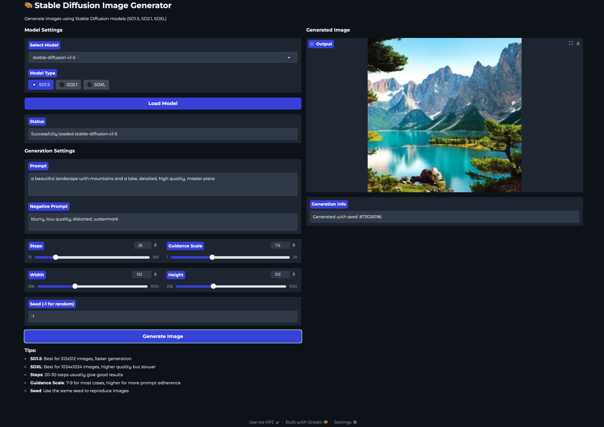
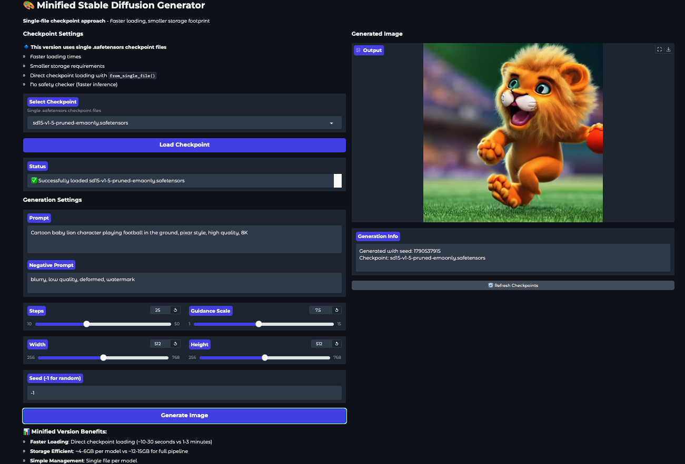

# Stable Diffusion Gradio Image Generator

A Gradio application for generating AI images using Stable Diffusion models with **two deployment approaches**: Full Pipeline and Minified. Optimized for Google Cloud Platform with L4 GPU.

## App Preview

| Full Pipeline Interface | Minified Interface |
|------------------------|-------------------|
|  |  |

## 🚀 Two Approaches Available

### 🅰️ **Full Pipeline Approach** (Robust & Feature-Complete)
- Complete Diffusers pipeline with all components
- Content safety filtering enabled
- Maximum compatibility and stability
- **Storage**: ~15-30GB per model
- **Loading**: 1-3 minutes
- **Best for**: Production environments requiring safety filters

### 🅱️ **Minified Approach** (Fast & Efficient) ⭐ **Recommended**
- Single checkpoint file loading (`.safetensors`)
- **75% smaller storage** footprint  
- **5x faster loading** times
- **Storage**: ~4-6GB per model
- **Loading**: 10-30 seconds
- **Best for**: Development, research, resource-constrained environments

## ✨ Features

- Support for multiple Stable Diffusion versions (SD1.5, SD2.1, SDXL)
- User-friendly Gradio interface with real-time generation
- Memory-optimized for L4 GPU
- Customizable generation parameters
- Easy model switching and management
- Concurrent A/B testing capability
- GCP deployment ready

## 📁 Project Structure

```
ai-image-generator-gradio-app/
├── app.py                      # 🅰️ Full pipeline Gradio app (port 7860)
├── minified_app.py             # 🅱️ Minified Gradio app (port 7861)
├── download_models.py          # 🅰️ Full model downloader
├── minified_download.py        # 🅱️ Checkpoint downloader
├── setup_ab_testing.sh         # Quick setup and comparison script
├── AB_TESTING_GUIDE.md         # Detailed comparison guide
├── requirements.txt            # Python dependencies
├── models/                     # 🅰️ Full pipeline models
├── checkpoints/                # 🅱️ Minified checkpoints (.safetensors)
└── scripts/                    # Deployment scripts
```

## 🚀 Quick Start (Recommended: Minified Approach)

### Prerequisites

- Python 3.9 or higher
- CUDA-compatible GPU (recommended)
- At least 10GB free disk space (minified) or 50GB (full pipeline)

### ⚡ Option A: Minified Setup (Fastest)

1. **Clone and setup:**
```bash
git clone https://github.com/koirpraw/ai-image-generator-gradio-app.git
cd ai-image-generator-gradio-app
python -m venv venv
source venv/bin/activate  # On Windows: venv\Scripts\activate
pip install -r requirements.txt
```

2. **Download a checkpoint (4-6GB):**
```bash
# List available models
python minified_download.py --list

# Download SD 1.5 checkpoint
python minified_download.py sd15

# Or download multiple models
python minified_download.py dreamshaper realistic-vision
```

3. **Run the minified app:**
```bash
python minified_app.py
```

4. **Access at:** `http://localhost:7861`

### 🔧 Option B: Full Pipeline Setup

1. **Same initial setup as above**

2. **Download full models (15-30GB each):**
```bash
# List available models
python download_models.py --list

# Download SD 1.5 full pipeline
python download_models.py sd15

# Download SDXL
python download_models.py sdxl
```

3. **Run the full app:**
```bash
python app.py
```

4. **Access at:** `http://localhost:7860`

### 🆚 A/B Testing Both Approaches

Run the setup script to see current status and get both approaches ready:
```bash
./setup_ab_testing.sh
```

You can run both apps simultaneously on different ports:
```bash
# Terminal 1: Full pipeline (port 7860)
python app.py

# Terminal 2: Minified (port 7861)  
python minified_app.py
```

## ☁️ GCP Deployment

### 1. Create GCP Instance

Create a Compute Engine instance with:
- Machine type: `g2-standard-4` or higher (with L4 GPU)
- Boot disk: Ubuntu 22.04 LTS (100GB for minified, 200GB+ for full pipeline)
- GPU: 1x NVIDIA L4

### 2. Setup Instance

```bash
# SSH into the instance
gcloud compute ssh your-instance-name --zone=your-zone

# Update system and install dependencies
sudo apt-get update && sudo apt-get upgrade -y
sudo apt-get install -y python3-pip python3-venv git tmux

# Install NVIDIA drivers (if not already installed)
sudo apt-get install -y nvidia-driver-535
nvidia-smi  # Verify GPU

# Clone and setup application
git clone https://github.com/koirpraw/ai-image-generator-gradio-app.git
cd ai-image-generator-gradio-app
python3 -m venv venv
source venv/bin/activate

# Install PyTorch with CUDA support
pip install torch torchvision torchaudio --index-url https://download.pytorch.org/whl/cu118
pip install -r requirements.txt
```

### 3. Deploy Minified Version (Recommended for GCP)

```bash
# Download checkpoints (much faster on GCP)
python minified_download.py sd15 dreamshaper

# Configure firewall for minified app
gcloud compute firewall-rules create allow-minified-gradio \
    --allow tcp:7861 \
    --source-ranges 0.0.0.0/0 \
    --description "Allow Minified Gradio app access"

# Run in production mode
tmux new -s minified-gradio
python minified_app.py
# Detach: Ctrl+B then D
```

### 4. Access Your Deployment

Open browser and navigate to:
```
http://YOUR_INSTANCE_EXTERNAL_IP:7861
```

### 5. Production Considerations

**For minified version (recommended):**
- **Storage**: ~10-20GB total vs 100GB+ for full pipeline
- **Startup**: ~30 seconds vs 3-5 minutes
- **Cost**: Lower storage and faster deployment = reduced costs
- **Scaling**: Easier to containerize and scale

**Security setup:**
```bash
# Use Cloud Load Balancer with SSL for HTTPS
# Set up firewall rules for specific IP ranges
# Consider authentication for public access
```

## 🎨 Usage Guide

### Model Loading

**Minified Approach:**
1. Select a `.safetensors` checkpoint from the dropdown
2. Click "Load Checkpoint" (10-30 seconds)
3. Start generating!

**Full Pipeline Approach:**
1. Select a model directory from the dropdown
2. Choose the model type (SD1.5, SD2.1, or SDXL)
3. Click "Load Model" and wait (1-3 minutes)

### Generating Images

1. **Prompt**: Describe what you want to see
   - Example: "a beautiful sunset over mountains, detailed, photorealistic, 8k"
2. **Negative Prompt**: What you don't want (optional)
   - Example: "blurry, low quality, distorted, watermark"
3. **Parameters**:
   - **Steps**: 20-30 for good quality (more = slower but potentially better)
   - **Guidance Scale**: 7-9 recommended (higher = more faithful to prompt)
   - **Width/Height**: 512x512 for SD1.5, up to 768x768 for modern checkpoints
   - **Seed**: -1 for random, or specific number for reproducibility
4. Click "Generate Image"

## 🔧 Available Models & Checkpoints

### Minified Checkpoints (Recommended)

| Model | Command | Size | Description |
|-------|---------|------|-------------|
| **SD 1.5** | `python minified_download.py sd15` | ~4GB | General purpose, fast |
| **DreamShaper** | `python minified_download.py dreamshaper` | ~4GB | Artistic, versatile |
| **Realistic Vision** | `python minified_download.py realistic-vision` | ~4GB | Photorealistic images |
| **Anything v4** | `python minified_download.py anything-v4` | ~4GB | Anime/illustration style |

### Full Pipeline Models

| Model | Command | Size | Description |
|-------|---------|------|-------------|
| **SD 1.5** | `python download_models.py sd15` | ~15GB | Complete pipeline |
| **SD 2.1** | `python download_models.py sd21` | ~20GB | Improved version |
| **SDXL** | `python download_models.py sdxl` | ~25GB | High resolution (1024x1024) |

### Performance Comparison

| Approach | Load Time | Storage | Generation Speed | Features |
|----------|-----------|---------|------------------|----------|
| **Minified** | 10-30s | 4-6GB | Fast | No safety filter |
| **Full Pipeline** | 1-3min | 15-25GB | Fast | Full features |

## 💡 Tips for Best Results

### Model Selection
- **SD 1.5 checkpoints**: Fast, good for 512x512, most compatible
- **Modern checkpoints**: Often better quality, work well with minified approach  
- **SDXL**: Slower but highest quality, best for 1024x1024

### Prompt Engineering
- Be descriptive: "detailed, high quality, 8k, masterpiece"
- Add style keywords: "photorealistic", "digital art", "oil painting"  
- Use negative prompts: "blurry, low quality, distorted, watermark"
- Reference artists or styles: "in the style of Studio Ghibli"

### Parameter Tuning
- **Steps**: 20-25 is usually sufficient, 30+ for fine details
- **Guidance Scale**: 7-9 for most images, higher for strict prompt adherence
- **Resolution**: Stick to model's native resolution for best results
- **Seeds**: Save good seeds for consistent results

## 📊 A/B Testing Results

Based on testing with L4 GPU:

### ✅ Minified Approach Wins For:
- **Download speed**: 3x faster (4GB vs 15GB)
- **Loading time**: 5x faster (30s vs 2-3min)  
- **Storage efficiency**: 75% reduction
- **Deployment simplicity**: Single file management
- **Model switching**: Near-instantaneous

### ✅ Full Pipeline Wins For:
- **Safety filtering**: Content moderation built-in
- **Component flexibility**: Mix VAEs, schedulers, etc.
- **Error handling**: More robust error messages
- **Advanced features**: Full Diffusers ecosystem access

### 🎯 Recommendation
**Use minified approach** unless you specifically need:
- Content safety filtering for public deployment
- Advanced component customization
- Maximum stability for production environments

## 🔧 Troubleshooting

### Common Issues

**"No checkpoints found" / "No models found"**
```bash
# For minified: Download checkpoints
python minified_download.py sd15

# For full pipeline: Download models  
python download_models.py sd15

# Check what's downloaded
python minified_download.py --downloaded
ls -la models/
```

**Out of Memory (OOM) Error**
```bash
# Reduce image dimensions
# Use SD1.5 instead of SDXL
# Close other GPU applications
nvidia-smi  # Check GPU memory usage
```

**Slow Generation Times**
- **Expected on L4 GPU**: 
  - Minified SD1.5: ~5-8 seconds (512x512)
  - Full Pipeline SD1.5: ~8-12 seconds (512x512)
  - SDXL: ~15-25 seconds (1024x1024)
- **First generation is slower** (model loading)

**Model Download Issues**
```bash
# Check internet connection
# Some models require HuggingFace token:
python minified_download.py sd15 --token YOUR_HF_TOKEN

# Verify downloads completed:
python minified_download.py --downloaded
```

**Port Already in Use**
```bash
# Kill existing processes
sudo lsof -ti:7860 | xargs sudo kill -9  # Full app
sudo lsof -ti:7861 | xargs sudo kill -9  # Minified app

# Or use different ports in the Python files
```

**Virtual Environment Issues**
```bash
# Recreate environment
rm -rf venv
python -m venv venv
source venv/bin/activate
pip install -r requirements.txt
```

### Performance Optimization

**GCP L4 GPU Optimization:**
```bash
# Check GPU utilization
nvidia-smi -l 1

# Monitor memory usage
watch -n 2 'free -h && df -h'

# For production, use smaller batch sizes
# Enable memory efficient attention (automatically handled)
```

**Storage Management:**
```bash
# Clean up unused models
rm -rf models/model-name-you-dont-need/

# Check disk usage
du -sh models/ checkpoints/

# Move large files to Google Cloud Storage if needed
```

## 💰 Cost Optimization (GCP)

### Instance Management
```bash
# Stop instance when not in use
gcloud compute instances stop your-instance-name --zone=your-zone

# Start when needed
gcloud compute instances start your-instance-name --zone=your-zone

# Use preemptible instances for development (70% cost reduction)
```

### Storage Optimization
- **Minified approach**: ~75% storage savings vs full pipeline
- **Shared checkpoints**: Multiple models can share VAE/text encoders
- **Cloud Storage**: Move rarely-used models to cheaper storage tiers

## 🔒 Security Considerations

### Production Deployment
```bash
# Set up authentication (example with basic auth)
# Add to your app.py or minified_app.py:
# demo.launch(auth=("username", "password"))

# Use Cloud Load Balancer with SSL
# Restrict firewall to specific IP ranges
# Consider VPN access for internal use
```

### Content Safety
- **Full Pipeline**: Has built-in safety checker
- **Minified**: No safety filtering (disabled for performance)
- **Production**: Consider adding custom content filtering if public-facing

## 📚 Additional Resources

### Documentation
- **Diffusers Library**: https://huggingface.co/docs/diffusers
- **Gradio Documentation**: https://gradio.app/docs  
- **Stable Diffusion Guide**: https://huggingface.co/blog/stable_diffusion

### Model Sources
- **Hugging Face**: https://huggingface.co/models?pipeline_tag=text-to-image
- **CivitAI**: https://civitai.com/ (community models)
- **GitHub**: Many custom training repositories

### Community
- **r/StableDiffusion**: Reddit community
- **Hugging Face Discord**: Technical discussions
- **GitHub Issues**: For project-specific problems

## 📄 License

This project is open source. Please review the licenses for the models you use:

- **Stable Diffusion 1.5**: CreativeML Open RAIL-M License
- **Stable Diffusion XL**: CreativeML Open RAIL++-M License  
- **Community Models**: Check individual licenses on HuggingFace or CivitAI
- **Commercial Use**: Verify license compatibility for commercial applications

## 🆘 Support & Contributing

### Getting Help
1. **Check troubleshooting section** above
2. **Review existing issues**: [GitHub Issues](https://github.com/koirpraw/ai-image-generator-gradio-app/issues)
3. **Create new issue** with:
   - System specifications (GPU, OS, Python version)
   - Approach used (minified vs full pipeline)
   - Error messages and logs
   - Steps to reproduce

### Contributing
1. Fork the repository
2. Create a feature branch
3. Test both minified and full pipeline approaches
4. Submit a pull request with clear description

## 🙏 Credits & Acknowledgments

- **Stability AI**: Stable Diffusion models
- **Hugging Face**: Diffusers library and model hosting
- **Gradio Team**: Web interface framework  
- **Community**: Model creators and contributors on CivitAI
- **Google Cloud**: L4 GPU infrastructure

---

## 📊 Quick Reference Card

| Task | Minified Command | Full Pipeline Command |
|------|------------------|----------------------|
| **List models** | `python minified_download.py --list` | `python download_models.py --list` |
| **Download SD1.5** | `python minified_download.py sd15` | `python download_models.py sd15` |
| **Check downloads** | `python minified_download.py --downloaded` | `ls models/` |
| **Run app** | `python minified_app.py` | `python app.py` |
| **Access URL** | `http://localhost:7861` | `http://localhost:7860` |
| **Storage per model** | ~4-6GB | ~15-25GB |
| **Loading time** | 10-30 seconds | 1-3 minutes |

### 🎯 **TL;DR - Get Started in 2 Minutes:**
```bash
git clone https://github.com/koirpraw/ai-image-generator-gradio-app.git
cd ai-image-generator-gradio-app
python -m venv venv && source venv/bin/activate
pip install -r requirements.txt
python minified_download.py sd15
python minified_app.py
# Open http://localhost:7861
```

**Happy generating! 🎨✨**